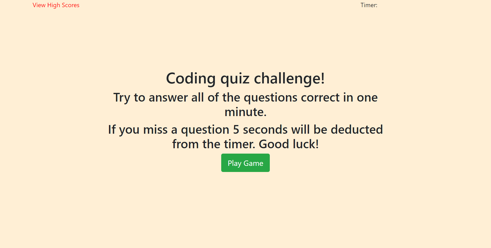
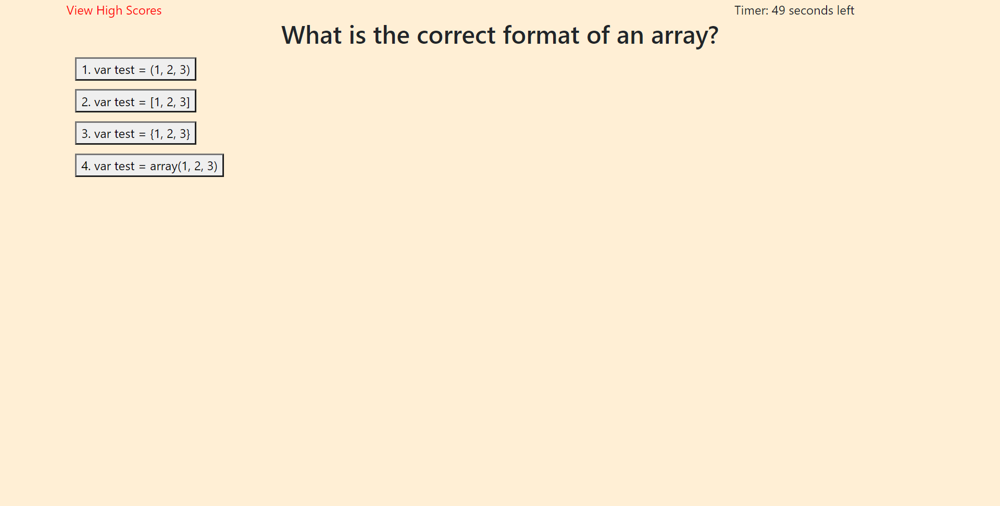
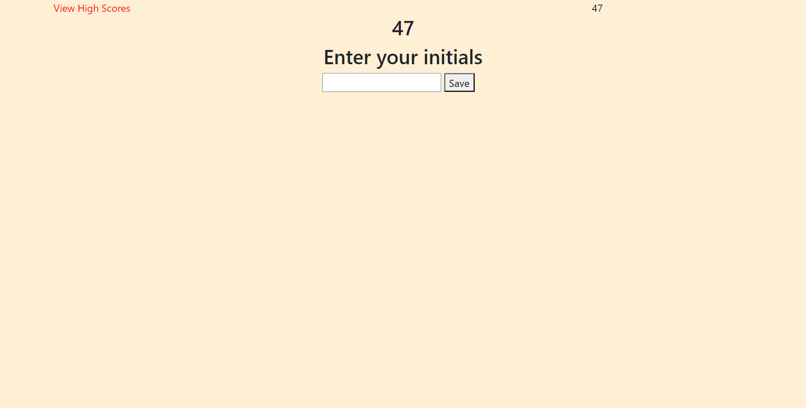

# Homework04 JavaScript Code Quiz

Link to site: [https://ctrahan94.github.io/homework04_javascript_code_quiz/](https://ctrahan94.github.io/homework04_javascript_code_quiz/)

link to repo: [https://github.com/ctrahan94/homework04_javascript_code_quiz](https://github.com/ctrahan94/homework04_javascript_code_quiz) 

## The Objective

To build a timed code quiz with multiple-choice questions.

## The Motive
To test your skills on the fundamentals of JavaScript.  

## The Solution
Used javascript to create a series of functions and if statements to build a timed quiz. 

## Credit
I had a good amount of help from my tutor Tyler as well as a handful of my classmates.

### What the deployed site looks like
#### Main Page

#### First question

#### Enter score

